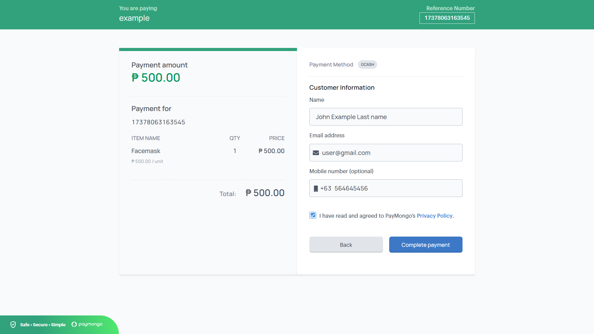

# Ecommerce-medical

  
  
  
  

# Products

  
  

# Login & Register

  
  

# User

    
    
    
    
    
    
    
    
    

# Admin

    
    
    
    
    
    
    

# Paymongo API

    
    

