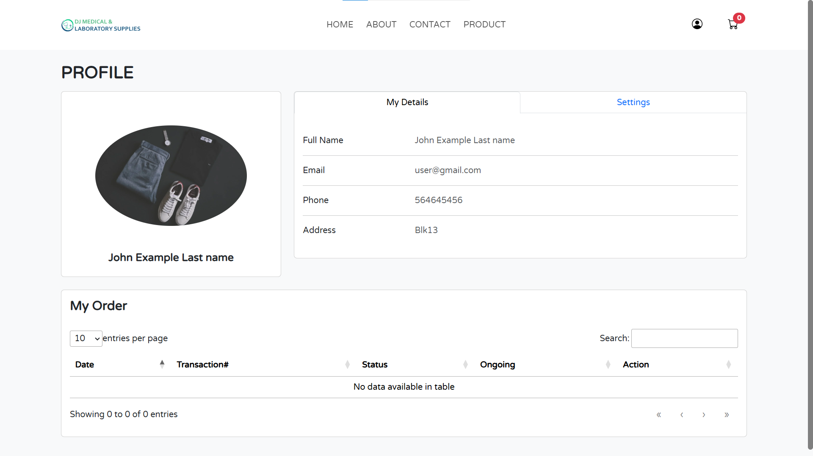
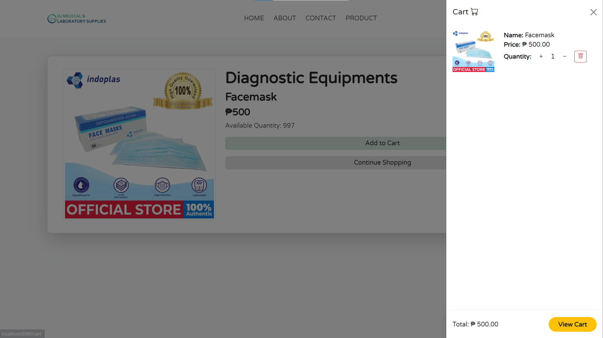
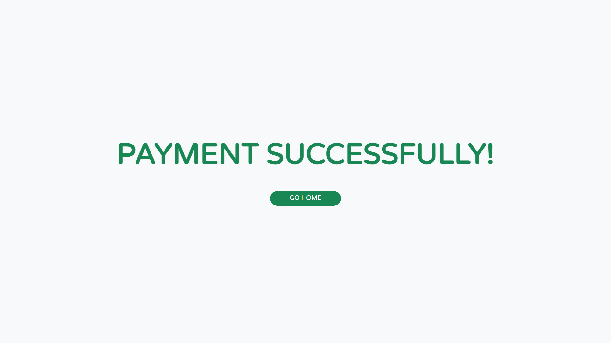
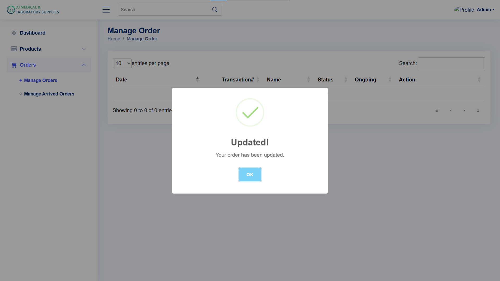

# Ecommerce-medical

  
  
  
  

# Products

  
  

# Login and Register

  
  

# User

    
    
    
    
    
    
    
    
    

# Admin

    
    
    
    
    
    
    

# API

    
    

